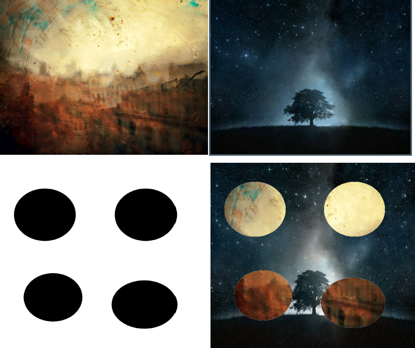
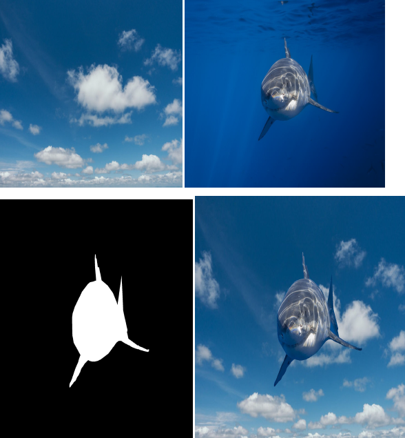
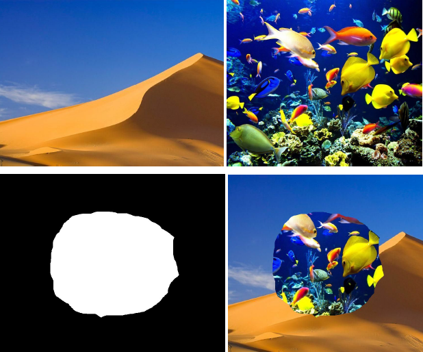
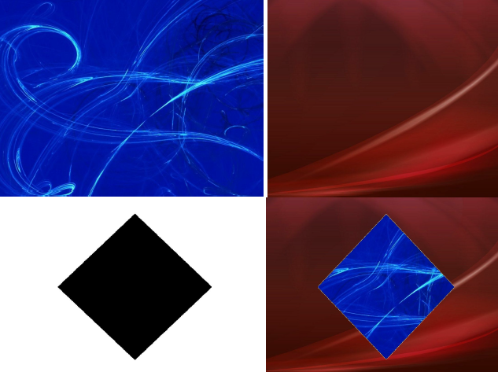

# Mixing and filter img

## Desarrollo del proyecto

Este trabajo práctico se basó en el desarrollo de una aplicación de línea de
comandos que combine dos imágenes usando una máscara de selección.
Implementando dos versiones: en lenguaje C y usando instrucciones SIMD en
lenguaje ensamblador.
Se cuenta con los archivos Enmascarar.c, headers.h, main.c, Enmascarar.asm,
script.sh.
El archivo script.sh compila el código fuente (“enmascarar.c”) y sus respectivos
headers, junto con el OBJ que crea NASM del archivo que posee todas las
funciones de Assembler (“enmascarar.asm”).
Se utilizó las librería TIME.H para medir el tiempo de ejecución de ASM Y C.
Con respecto a C se utilizaron las funciones fopen,fwrite,fclose,fread,malloc para
manejar los archivos de imágenes.
Se cuenta con un script.sh que ejecuta por cada directorio de imágenes los
algoritmos correspondientes para generar la imagen resultante.

__Como herramientas para desarrollar el mismo se usaron los siguientes:__

- Editores: Gedit, VIsual Studio Code
- IDE: SASM
    Compiladores: NASM para compilar los códigos .asm, y GCC para
    compilar el código de C y llamar a los objetos de código creados
    anteriormente por NASM para vincular las funciones de Assembler
    llamadas desde C.
- GraphicsMagick para exportar las imágenes a un archivo .rgb (vector
    de bytes) y
    visualizar las imágenes con tal formato.

## Código Fuente: C

```c
void enmascarar_c(PIXEL *pixel_img1, PIXEL *pixel_img2, PIXEL *pixel_mascara, SIZE tamanio) {

    FILE *resultado = fopen("resultado.rgb", "wb");
    SIZE cursor = 0;
    
    while(cursor < tamanio){
        //Se va avanzando pixel por pixel y
        //Se van guardando los pixeles obtenidos al mezclar
        *(pixel_img1 + cursor) = mezclar(*(pixel_img1 + cursor),
        *(pixel_img2 + cursor), *(pixel_mascara + cursor));
        cursor++;
    }
    
    fwrite(pixel_img1, TAMANIO_PIXEL, tamanio, resultado);
    fclose(resultado);
}
```

### Función auxiliar

```c
PIXEL mezclar(PIXEL pixel_img1, PIXEL pixel_img2, PIXEL pixel_mascara) {
    if(pixel_mascara == NEGRO) return pixel_img1;
    if(pixel_mascara == BLANCO) return pixel_img2;
}
```

En la parte de C básicamente se buscó la manera de recorrer pixel a pixel la imagen
para compararla con los que sean correspondientes a la máscara en ese lugar y así
colocar en la imágen de resultado el indicado según el color, para ello se desarrolló
una función auxiliar que se encargaba de ello.

Desde C también se invoca el método desarrollado en Asembler declarándolo de la
siguiente manera:

```c
extern void enmascarar_asm(PIXEL *pixel_img1, PIXEL *pixel_img2, PIXEL *pixel_mascara, SIZE tamanio);
```

Para luego poder invocarlo desde el main.

```c
enmascarar_asm(pixel_img1, pixel_img2, pixel_mascara, tamanio_mascara);
```

Se controló el tiempo de performance de cada algoritmo mediante la inicialización
de una variable de tiempo proporcionado por la librería time.

```c
static clock_t reloj_inicio_c, reloj_fin_c;
static double tiempo_ejecucion_c = 0;

reloj_inicio_c = clock();
enmascarar_c(pixel_img1, pixel_img2, pixel_mascara, tamanio_mascara);
reloj_fin_c = clock();
```

## Código Fuente: Assembler

```armasm
;inicializamos etiqueta con 4 bytes blancos para comparar con las imágenes.
pixeles_blancos db 0xFF,0xFF,0xFF,0xFF

;para inicializar en cero el indice de recorrido.
pixel_inicial db 0x0,

;copiamos a los registros los parametros de la función en su respectivo orden.
mov eax, [ebp+8]
mov ecx, [ebp+12]
mov edx, [ebp+16]

;copiamos los pixeles para comparar.
mov edi, [pixeles_blancos]

;inicializamos el registro índice.
mov esi, [pixel_inicial]

;en xmm3 colocaremos los pixeles de la imagen resultado de la combinación.
recorrer_imagen:
movd xmm2, [edx+esi] ;xmm2 = dir base de mask
movd xmm1, [ecx+esi] ;xmm1 = dir base de img2
movd xmm0, [eax+esi] ;xmm0 = dir base de img1

cmp [edx+esi], edi ;cmp si pixel 0 de mascara es blanco.
je ponerPixel_imgen2 ;SI, entonces salta a Pixel de imagen 2
movapd xmm3,xmm0 ;NO, entonces xmm3 = valores de imagen 1
jmp control ;salta a Control de recorridode imagen.
ponerPixel_imgen2:
movapd xmm3,xmm1 ;xmm3 = valores de imagen 2

control:
add esi, 4 ;avanzamos el indice
cmp esi, [ebp+20] ;controlamos si recorrimos toda la imagen.
jle recorrer_imagen ;salta si el valor es menor o igua l
```

## ## Código Fuente: SSH

```bash
#Compilamos para el tipo C invoca función de Asembler
#Primero se ensambla el código de Asembler
ruta=$PWD
nasm -f elf32 Enmascarar.asm -o enmascarar.o
gcc -m32 -o tp enmascarar.o Enmascarar.c
echo $1
cd $1
numdirec=0

for i in $(ls -d */); do
    echo $i
    count=0

    for x in $(ls $i); do

        if [ "$count" -eq 0 ]; then
            var1=$1$i$x
        fi

        if [ "$count" -eq 2 ]; then
            var3=$1$i$x
        fi

        if [ "$count" -eq 1 ]; then
            var2=$1$i$x
        fi

        count=$((count + 1))
    done

    #Luego se compilan ambos a través de GCC
    #Se ejecuta el archivo pasandole los parámetros requeridos
    cd $ruta
    ./tp "$var1" "$var2" "$var3"
    mv resultado.rgb resultado$numdirec.rgb
    sleep 10
    numdirec=$((numdirec + 1))
done

exit

```

El script lee los directorios que hay en la ruta ingresada y por cada uno ejecuta la
tarea indicada.

## Resultados obtenidos

### Resolución de 1600x1200



### Resolución 1920x1080



### Resolución 800x600



### Resolución 1024x768



## Conclusión

En el desarrollo del programa, pudimos ver como utilizar los registros
proporcionados por los nuevos set de instrucciones de MMX, SSE y la
arquitectura de 32 bits para tratar con archivos de imágenes y
manipularlas bit a bit y así poder modificarlas. Nos encontramos con una
gran cantidad de nuevas instrucciones y en algunos casos fue difícil
entender su utilidad y la manera de poder trabajar con datos
empaquetados para aprovechar el tratamiento paralelo de los datos a
través de una instrucción.
Del lado del código C, se pudo ver cómo operar sobre archivos binarios.
Se requirió del programa GraphicsMagick, que al principio costó
entender cómo manipularlo hasta que se encontró una serie de
comandos para convertir las imágenes utilizadas a RGB, y visualizar las
generadas. La generación de un Headers que contenga las variables y
los métodos globales nos ayudó a definir ciertos parámetros
declarativos, después simplemente utilizarlos y tener un código más
claro y entendible.

### fuentes

#### ASM

- [http://www.angelcode.com/dev/mmx/mmx.html>](<http://www.angelcode.com/dev/mmx/mmx.html>)
- [https://youtu.be/4pUgnn70mmc/>](<https://youtu.be/4pUgnn70mmc/>)
- [http://www.forosdelweb.com/f41/nasm-ensamblador-759655/>](<http://www.forosdelweb.com/f41/nasm-ensamblador-759655/>)
- [http://webcache.googleusercontent.com/search?q=cache:http://www.sromero.org/ext/articulos/gfx/graf3.html>](<http://webcache.googleusercontent.com/search?q=cache:http://www.sromero.org/ext/articulos/gfx/graf3.html>)
- [http://ict.udlap.mx/people/oleg/docencia/Assembler/asm_interrup_10.html>](<http://ict.udlap.mx/people/oleg/docencia/Assembler/asm_interrup_10.html>)
- [https://www.tek-tips.com/viewthread.cfm?qid=193856/>](<https://www.tek-tips.com/viewthread.cfm?qid=193856/>)
- [https://stackoverflow.com/questions/41024390/nasm-how-to-create-handle-basic-bmp-file-using-intel-64-bit-assembly/>](<https://stackoverflow.com/questions/41024390/nasm-how-to-create-handle-basic-bmp-file-using-intel-64-bit-assembly/>)
- [https://www.cs.uaf.edu/2017/fall/cs301/reference/x86_64.html>](<https://www.cs.uaf.edu/2017/fall/cs301/reference/x86_64.html>)
- [https://www.daniweb.com/programming/software-development/threads/229040/nasmpainting-pixels/>](<https://www.daniweb.com/programming/software-development/threads/229040/nasmpainting-pixels/>)

#### C

- [https://www.geeksforgeeks.org/putpixel-function-c/](https://www.geeksforgeeks.org/putpixel-function-c/)
- [https://youtu.be/oPrRRqJb9B8](https://youtu.be/oPrRRqJb9B8)
- [https://www.youtube.com/watch?v=15aqFQQVBWU](https://www.youtube.com/watch?v=15aqFQQVBWU)
- [https://www.youtube.com/watch?v=_cVUOZKkksc&list=PL-DwF6obA18Id8flgAvqZzYPNN8TSPQFH](https://www.youtube.com/watch?v=_cVUOZKkksc&list=PL-DwF6obA18Id8flgAvqZzYPNN8TSPQFH)
- [https://www.freefileconvert.com/jpg-rgb](https://www.freefileconvert.com/jpg-rgb)
- [https://codeday.me/es/qa/20190314/308844.html](https://codeday.me/es/qa/20190314/308844.html)
- [https://codeday.me/es/qa/20190519/721034.html](https://codeday.me/es/qa/20190519/721034.html)
